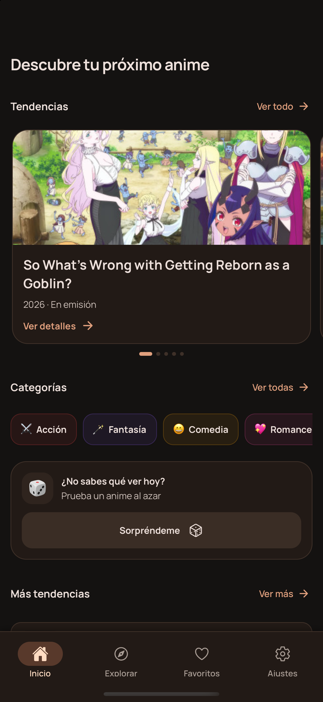
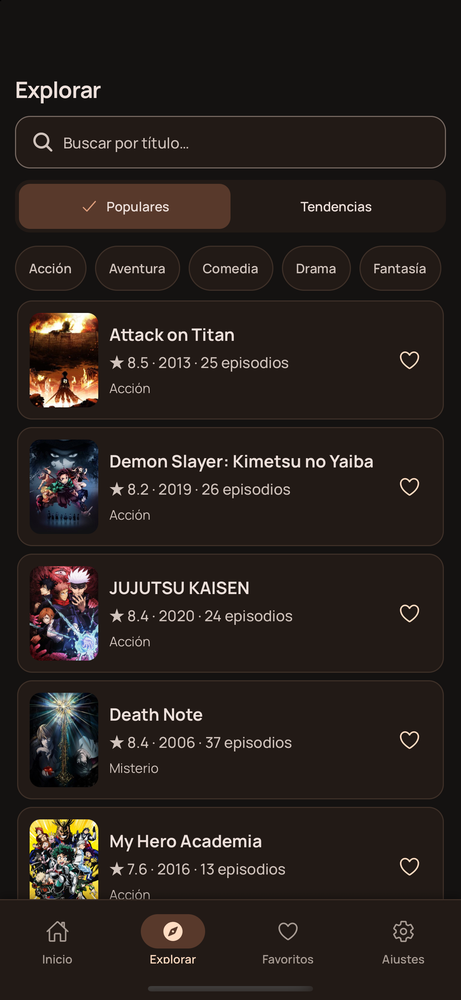
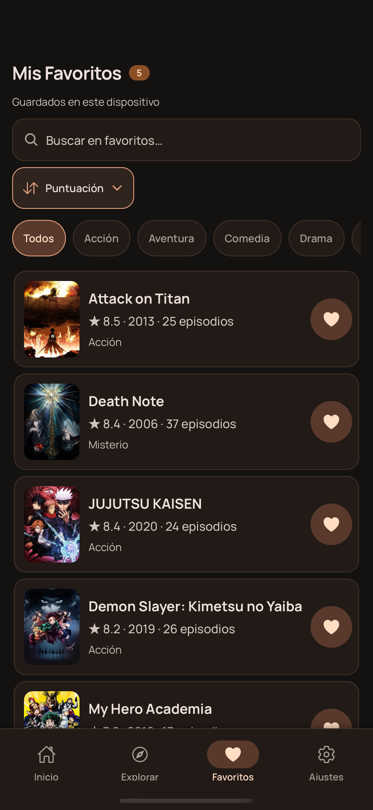

# AniDex


[](./LICENSE)
[](https://github.com/NickDavid1811/anidex/releases/tag/v0.1.0-beta.1)

AniDex is a cross-platform mobile app for discovering anime, exploring detailed information, and building a personal favorites collection. It uses the [AniList GraphQL API](https://anilist.co) and is built with Expo and React Native.

## Preview

<p align="center">
  
  
  
</p>

## Features

- Browse trending anime and featured rankings.
- Search by title and filter by genre, popularity, or trending status.
- View synopses, formats, airing status, episode counts, seasons, and scores.
- Discover a random anime through an interactive roulette.
- Store favorites locally with search, filtering, sorting, and undo support.
- Optionally connect an AniList account through OAuth.
- Switch between light, dark, and system themes.
- Use the app on Android, iOS, and the web.

## Tech stack

- [Expo SDK 57](https://docs.expo.dev/versions/v57.0.0/) and React Native 0.86
- [Expo Router](https://docs.expo.dev/router/introduction/) for file-based navigation
- TypeScript
- NativeWind and Tailwind CSS
- AniList GraphQL API
- Expo SQLite for local persistence on native platforms
- Expo SecureStore for securely storing AniList sessions on the device

## Requirements

- [Bun](https://bun.sh/)
- A physical device or emulator compatible with Expo
- An AniList developer application only if you want to test account authentication

## Getting started

1. Clone the repository:

   ```bash
   git clone https://github.com/NickDavid1811/anidex.git
   cd anidex
   ```

2. Install dependencies:

   ```bash
   bun install
   ```

3. Start the Expo development server:

   ```bash
   bunx expo start
   ```

Browsing AniList's public catalog does not require credentials.

## AniList OAuth configuration

OAuth configuration is optional and is only required to connect an AniList profile from the settings screen.

1. Create an application in the AniList developer settings.
2. Set `anidex://auth/callback` as its redirect URL.
3. Create a `.env.local` file in the project root:

   ```env
   EXPO_PUBLIC_ANILIST_CLIENT_ID=your_client_id
   ```

4. Build and install a development client:

   ```bash
   bun run ios
   # or
   bun run android
   ```

The OAuth flow is not available in Expo Go or the web version. AniDex stores the session token securely on the device with SecureStore.

## Available scripts

| Command | Description |
| --- | --- |
| `bun run start` | Start the Expo development server. |
| `bun run android` | Build and run the Android app. |
| `bun run ios` | Build and run the iOS app. |
| `bun run web` | Start the web app. |
| `bun run lint` | Run ESLint with the Expo configuration. |
| `bunx tsc --noEmit` | Run TypeScript type checking. |

## Project structure

```text
src/
├── app/                 # Expo Router routes and screens
├── components/          # Shared UI components
├── features/
│   ├── anime/           # Catalog, search, and anime details
│   ├── auth/            # AniList OAuth session
│   ├── favorites/       # Favorites and local persistence
│   └── theme/           # Appearance preferences
└── lib/                 # Shared clients and infrastructure
```

The codebase is organized by feature. Routes stay inside `src/app`, while domain logic, hooks, services, and feature-specific components live in `src/features`.

## Data and persistence

Favorites are stored on the device and are not currently synchronized with the user's AniList account. Native platforms use SQLite with a local storage fallback. Connecting AniList identifies the user's profile and preserves their session, but it does not modify their remote lists.

Anime titles, images, descriptions, and scores belong to their respective owners and are retrieved through the AniList API. AniDex is not affiliated with or officially endorsed by AniList.

## Project status

AniDex is under active development. Planned improvements include AniList favorites synchronization, broader test coverage, and distribution-ready builds.

## License

This project is available under the terms of the [MIT License](./LICENSE).
